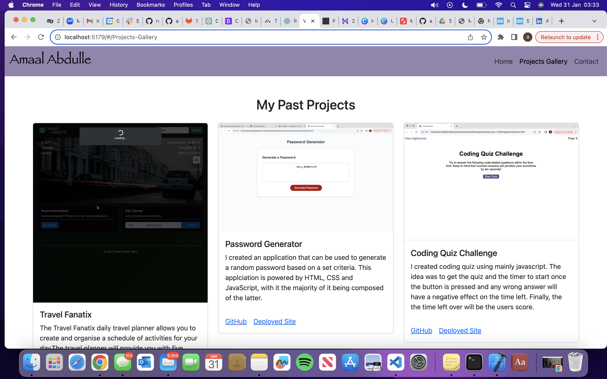

# react-portfolio

## Description

Welcome to my React portfolio! I have developed this portfolio to showcase my front-end web development skills and projects. Using React, I've created a polished and professional site with a mobile-first design, offering easy navigation and accessibility. The color palette is carefully chosen, ensuring readability and a visually appealing look.

## Installation

1. Install Node.js and npm:
    Make sure you have Node.js and npm (Node Package Manager) installed on your system. You can download them from https://nodejs.org/.

2. Generate a starter React app using Vite:
    npm create vite@4.4.1 reactpractice -- --template react
    cd reactpractice
    npm install
    npm run dev

3. Install Bootstrap:
    Run npm i --save bootstrap @popperjs/core in your command line to install Bootstrap and Popper.js.
    Add import 'bootstrap/dist/css/bootstrap.min.css'; and import * as bootstrap from 'bootstrap' to the main.jsx file.

4. Install react-router:
    Be sure to install the axios library by running npm install axios in your terminal.

## Usage

You can navigate through my projects and learn more about each one. Feel free to check out the alt text of images, showcasing my attention to accessibility details. Deployed website can be accessed at: http://localhost:5176/. 

## Credits

This portfolio is a solo project, and all components, including the React structure and styling, were created by myself. The skills and knowledge gained from collaborating with the EdX Web Development team were applied to enhance the accessibility and user experience.

## License

N/A
